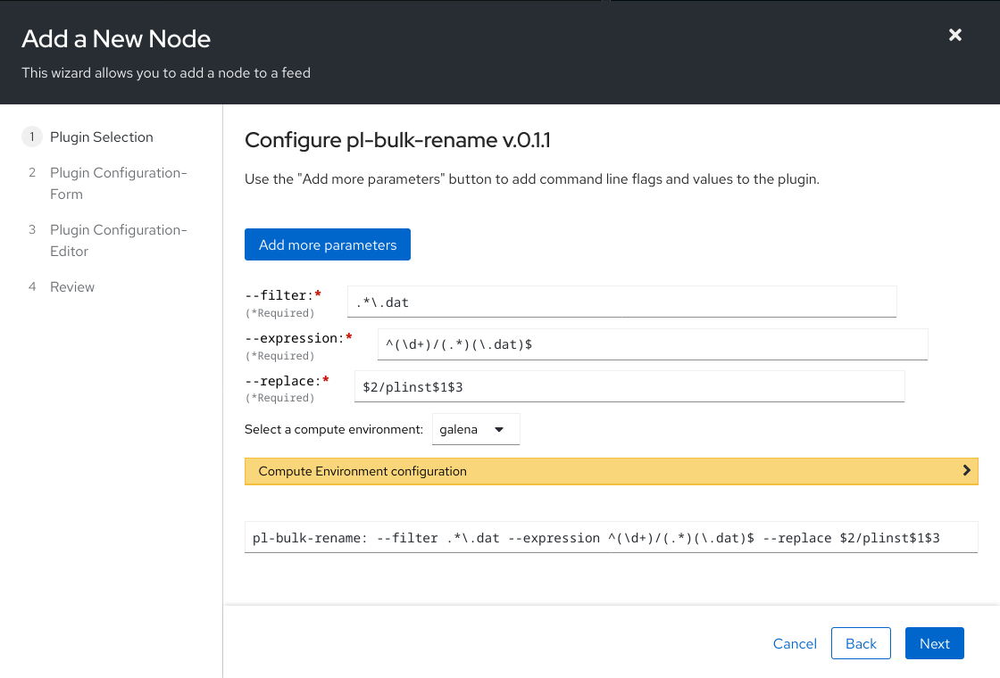

# Bulk Rename

[](https://hub.docker.com/r/fnndsc/pl-bulk-rename)
[](https://github.com/FNNDSC/pl-bulk-rename/blob/main/LICENSE)
[](https://github.com/FNNDSC/pl-bulk-rename/actions/workflows/ci.yml)

`pl-bulk-rename` is a [_ChRIS_](https://chrisproject.org/)
_ds_ plugin which copies files from an input directory to an
output directory under different names using regular expressions.

## Installation

`pl-bulk-rename` is a _[ChRIS](https://chrisproject.org/) plugin_, meaning it can
run from either within _ChRIS_ or the command-line.

[](https://chrisstore.co/plugin/pl-bulk-rename)

## Usage

Regular expression syntax is based on the [regex](https://crates.io/crates/regex) crate.
See https://docs.rs/regex/1.5.5/regex/#grouping-and-flags

### Local Usage

To get started with local command-line usage, use [Apptainer](https://apptainer.org/)
(a.k.a. Singularity) to run `pl-bulk-rename` as a container.

To print its available options, run:

```shell
singularity exec docker://fnndsc/pl-bulk-rename bulkrename --help
```

## Examples

`bulkrename` copies data from an input directory to an output directory.

Consider the data in [`examples/input`](examples/input):

```
examples/input
├── a
│   ├── food.txt
│   └── log
├── b
│   ├── food.txt
│   └── log
└── c
    ├── food.txt
    └── log
```

To rename every `.txt` file to have the name of their parent directory:

```shell
bulkrename --filter '.*\.txt' \
           --expression '^(.*?)/(.*?)\.txt$' \
           --replace '$1.txt' \
           examples/input examples/filewise
```

To rename the subdirectories `a`, `b`, `c`, of the input directory to have a prefix `pear_`:

```shell
bulkrename --filter '^[abc]$' \
           --expression '([abc])' \
           --replace 'pear_$1' \
           examples/input examples/dirwise
```

### Recipes

Pracitcal walkthroughs of how to use `pl-bulk-rename` in _ChRIS_ feeds.

#### Restack joined branches following `pl-topologicalcopy --groupByInstance`

Factor levels (i.e. the independent variable) of a data experiment are
represented in a  _ChRIS_ feed as parallel/sibling branches of a tree.

Consider this example data experiment:

1. We create a feed using `pl-dircopy` which produces our input files
   `subject1.txt`, `subject2.txt`, `subject3.txt`, ...
2. We run 3 instances of a _ds_ plugin `pl-experiment` which, for every
   `*.txt` in its input directory, creates a resulting `*.dat` in the output directory.
   The plugin instance IDs are 4, 5, 6.
3. Over all the results we want to perform aggregation and data visualization
   to arrive at a scientific conclusion.

Joining the branches is done using
[`pl-topologicalcopy`](https://github.com/FNNDSC/pl-topologicalcopy).
Since the outputs of `pl-experiment` for each instance is the same
(something like `subject1.dat`, `subject2.dat`, `subject3.dat`, ...)
we use `--groupByInstance` so that the output of the feed-join looks like

```
pl-topologicalcopy/data
├── 4
│   ├── subject1.dat
│   ├── subject2.dat
│   └── subject3.dat
├── 5
│   ├── subject1.dat
│   ├── subject2.dat
│   └── subject3.dat
└── 6
    ├── subject1.dat
    ├── subject2.dat
    └── subject3.dat
```

Next, we use **`pl-bulk-rename`** to reorganize the results by subject,
which makes more sense in the context of our downstream analysis.

```
pl-bulk-rename/data
├── subject1
│   ├── plinst4.dat
│   ├── plinst5.dat
│   └── plinst6.dat
├── subject2
│   ├── plinst4.dat
│   ├── plinst5.dat
│   └── plinst6.dat
└── subject3
    ├── plinst4.dat
    ├── plinst5.dat
    └── plinst6.dat
```

In the [_ChRIS_ user interface](https://github.com/FNNDSC/ChRIS_ui/),
**`pl-bulk-rename`** would be configured like this:



The whole feed for the experiment will look something like

```
      O      id=3  pl-dircopy --dir uploads/user/inputData
    / | \
   /  |  \
  O   |   |  id=4  pl-experiment --factor 0.05
  |   O   |  id=5  pl-experiment --factor 0.10
  |   |   O  id=6  pl-experiment --factor 0.15
   \  |  /
    \ | /
      O      id=7  pl-topologicalcopy --plugininstances 4,5,6 --groupByInstance
      |
      O      id=8  pl-bulk-rename     --filter '.*\.dat'              \
      |                           --expression '^(\d+)/(.*)(\.dat)$'  \
      |                              --replace '$2/plinst$1$3'
      |
      O      id=9  pl-aggregate-stats
      |
      O      id=10 pl-plot-data
```


#### Rename multiple files in subdirectories

Continuing from above, you might want to rename the data files in
each subdirectory.

```
inputdir/
├── subject1
│   ├── plinst4.dat
│   ├── plinst5.dat
│   └── plinst6.dat
├── subject2
│   ├── plinst4.dat
│   ├── plinst5.dat
│   └── plinst6.dat
└── subject3
    ├── plinst4.dat
    ├── plinst5.dat
    └── plinst6.dat
```

These file names aren't too helpful. We want to rename them
to be descriptive of how they were produced instead of referring
to them by _ChRIS_ plugin instance IDs,
e.g. rename `plinst4.dat` to `experiment_factor_0.05_result.dat`.

```
inputdir/
├── subject1
│   ├── experiment_factor_0.05_result.dat
│   ├── experiment_factor_0.10_result.dat
│   └── experiment_factor_0.15_result.dat
├── subject2
│   ├── experiment_factor_0.05_result.dat
│   ├── experiment_factor_0.10_result.dat
│   └── experiment_factor_0.15_result.dat
└── subject3
    ├── experiment_factor_0.05_result.dat
    ├── experiment_factor_0.10_result.dat
    └── experiment_factor_0.15_result.dat
```

For each factor, call `pl-bulk-rename` to map `plinstN` to `experiment_factor_M_result`.

```
      O      id=8
    / | \
   /  |  \
  O   |   |  id=11  pl-bulk-rename     --filter '.*/plinst4\.dat$'  \
  |   |   |                        --expression '^(.*)/(.*)$'       \
  |   |   |                           --replace '$1/experiment_factor_0.05_result.dat'
  |   |   |
  |   O   |  id=12  pl-bulk-rename     --filter '.*/plinst5\.dat$'  \
  |   |   |                        --expression '^(.*)/(.*)$'       \
  |   |   |                           --replace '$1/experiment_factor_0.10_result.dat'
  |   |   |
  |   |   O  id=13  pl-bulk-rename     --filter '.*/plinst6\.dat$'  \
  |   |   |                        --expression '^(.*)/(.*)$'       \
  |   |   |                           --replace '$1/experiment_factor_0.15_result.dat'
   \  |  /
    \ | /
      O      id=14  pl-topologicalcopy --plugininstances 11,12,13
```
